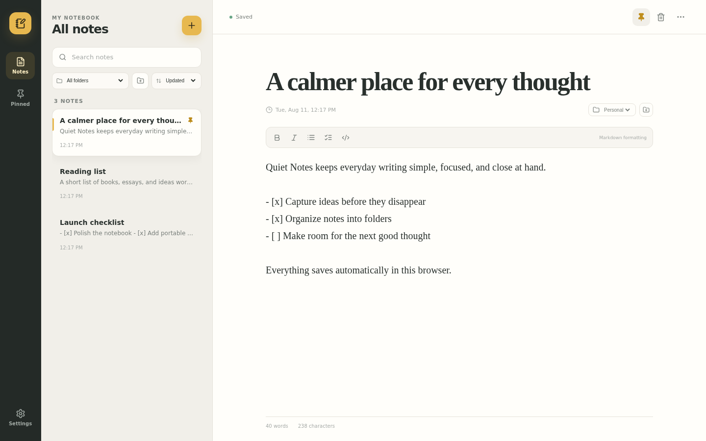

# Quiet Notes

**[Open the live demo →](https://gamer-09.github.io/Note_vault/)**



A polished everyday notepad with a concealed, encrypted private workspace.

For the intended security boundary and explicit limitations, read the [threat model](THREAT_MODEL.md).

## What it does

- Create, edit, search, pin, and delete ordinary notes
- Autosave notes in the browser with light and dark themes
- Export/import normal notes as JSON backups
- Install as a PWA for an app-like desktop experience
- Open a private workspace through a typing shortcut on a completely blank new note
- Encrypt private files, filenames, file types, and private notes with AES-256-GCM
- Derive the encryption key from the passphrase with PBKDF2-SHA-256 (310,000 iterations)
- Keep the unlocked key in memory only and auto-lock after five minutes of inactivity
- Preview encrypted text, images, and PDFs; decrypt other files only when downloading

## Version 1.1 features

Six productivity and privacy additions are included:

1. **Note folders** — create folders, assign notes, and filter the notebook by folder.
2. **Formatting and checklists** — apply bold, italic, bullets, checkboxes, and inline-code Markdown from the editor toolbar.
3. **Flexible note sorting** — sort by last updated, creation date, or title while pinned notes stay first.
4. **Encrypted vault folders** — file new items into encrypted folders, filter by folder, and move existing items without exposing folder names in storage.
5. **Passphrase rotation** — change the vault passphrase from the unlocked Security panel; every item is atomically re-encrypted with a fresh key.
6. **Encrypted backup and restore** — export the complete vault as a portable `.qnvault` archive and restore it from the concealed Settings panel on another browser or device.

Version 1.1.1 also activates the editor's **More options** menu with copy, duplicate, text export, and delete actions.

## Version 1.2 portable archive

An unlocked vault can create a portable backup from the **Backup** button. Filenames, folders, metadata, and contents are serialized inside one AES-256-GCM authenticated ciphertext. Only a forward-compatible format header is visible:

```json
{
  "header": {
    "format": "quiet-notes-vault",
    "version": 1,
    "kdf": { "name": "PBKDF2", "hash": "SHA-256", "iterations": 310000, "salt": "…" },
    "cipher": { "name": "AES-GCM", "keyBits": 256, "tagBits": 128, "iv": "…" }
  },
  "ciphertext": "…"
}
```

The archive passphrase protects the file and becomes the restored vault's passphrase. Restore is available in the concealed private-workspace Settings on any compatible browser. Unknown format, KDF, or cipher versions are rejected rather than guessed.

Version 1.2.1 normalizes native select controls across Windows and other platforms so folder and sorting fields retain the same single-border layout. Version 1.2.2 removes the forced desktop minimum height and adds a bottom safe zone so rail controls remain visible above taskbars on short or scaled displays. Version 1.2.3 adds independent show/hide controls to every passphrase and confirmation field without persisting the revealed value.

## Run locally

```bash
npm install
npm run dev
```

Open the local URL printed by Vite. For a production build:

```bash
npm run build
npm run preview
```

Run the adversarial crypto and session tests with:

```bash
npm test
```

## Deployment

The public demo is deployed at [gamer-09.github.io/Note_vault](https://gamer-09.github.io/Note_vault/) using the free GitHub Pages service. Every push to `main` runs the full test suite, builds Vite with the `/Note_vault/` base path, and deploys the resulting `dist` artifact through `.github/workflows/deploy-pages.yml`.

No paid hosting service or application backend is required.

## Set up the concealed private workspace

1. Open **Settings**.
2. At the bottom, click the ordinary **Quiet Notes · Version 1.2.3** row five times.
3. Set and confirm a passphrase of at least eight characters.
4. Close Settings.
5. Create a completely blank new note.
6. In the body, type exactly:

   ```text
   Password = your passphrase
   ```

   Pause briefly or press Enter. The temporary blank note is deleted and the private workspace opens.
7. Use **Lock & close** to clear the key from memory and return to the notepad.

The trigger only works on a fresh note with a blank title. Trigger-like text is deliberately excluded from normal-note autosave while the note remains eligible, so the passphrase is not written into the notes database.

## Storage and security model

Private items are encrypted **before** being stored in IndexedDB. Their names, MIME types, and contents are not readable in browser storage without the passphrase. There is no backend, account, analytics service, or cloud sync in this project.

### Important, honest limitation

No application can store a file on a PC while also storing no bytes anywhere on that PC. Quiet Notes stores encrypted bytes inside the browser profile rather than visible plaintext files in Documents/Downloads. A normal file browser will not show the original filenames or readable contents, but forensic tools can still detect that encrypted application data exists.

- Clearing this site's browser data permanently erases the private workspace.
- Losing the passphrase permanently loses access; there is no recovery key.
- A compromised browser, malicious extension, keylogger, or malware running while the vault is unlocked can defeat client-side protection.
- Ordinary notes are local but **not encrypted**. Only items placed inside the private workspace are encrypted.
- The current per-file limit is 25 MB to avoid excessive browser-memory use.

For stronger OS-level protection, combine this app with full-disk encryption (BitLocker, FileVault, or LUKS) and a trusted browser profile.

## Project structure

```text
src/App.jsx       Main notes UI, hidden setup flow, and private workspace
src/crypto.js        PBKDF2 and AES-GCM helpers
src/vaultArchive.js  Portable encrypted archive format
src/db.js            IndexedDB persistence
src/styles.css       Responsive desktop/mobile styling
public/sw.js      Offline app-shell cache
```

## License

See [LICENSE](LICENSE).
